# Torrey: Physically-Based Path-Tracing Renderer

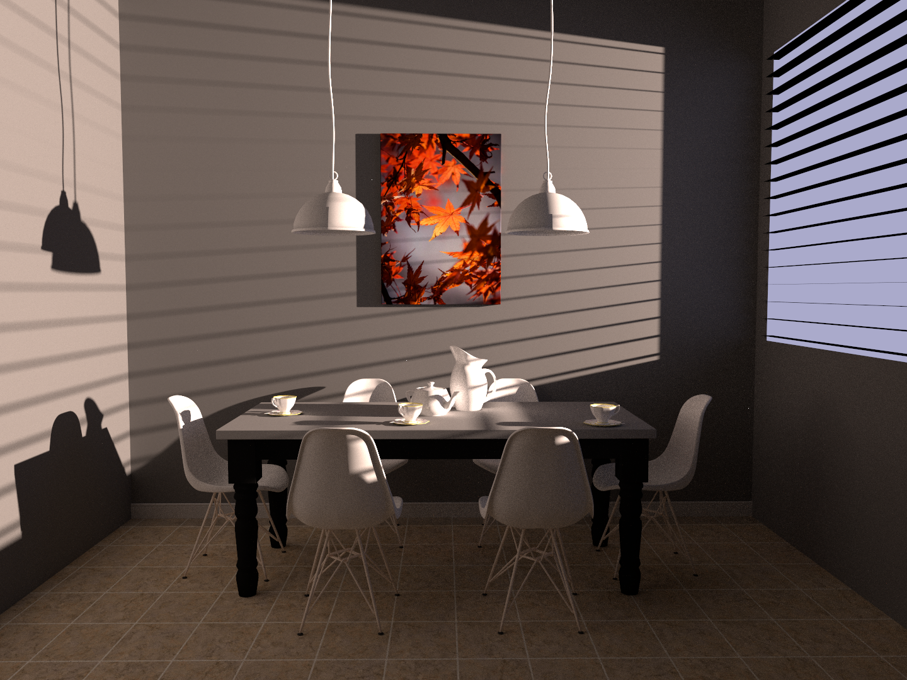

## Introduction

This is the course project of [UCSD CSE 168 Computer Graphics II: Rendering](https://cseweb.ucsd.edu/~tzli/cse168/sp2023/). Throughout the quarter, we built a physically-based renderer (from ray-tracing to path-tracing) almost from scratch.

All the high-level feature descriptions and concept explanations are outlined in our homework specification:

- [Homework 1: Ray Tracing](https://cseweb.ucsd.edu/~tzli/cse168/sp2023/homework1.pdf)
- [Homework 2: Triangles and acceleration structures](https://cseweb.ucsd.edu/~tzli/cse168/sp2023/homework2.pdf)
- [Homework 3: Textures, shading normals, Fresnel, and area lights](https://cseweb.ucsd.edu/~tzli/cse168/sp2023/homework3.pdf)
- [Homework 4: Indirect lighting, BRDFs, and Multiple Importance Sampling](https://cseweb.ucsd.edu/~tzli/cse168/sp2023/homework4.pdf)

## Feature Highlights

My renderer implements many fundamental features and functionalities presented in modern renderers. Here are some selected ones, sorted from their order in homework specifications:

### Antialiasing

Each pixel is not a point but a little rectangle. If we only shoot a camera ray through the center of each pixel, all the shapes in the scene will only have details at the image resolution level. As a result, the smaller a shape is, the more jaggy its boundary will appear to be.

To solve this, we shoot multiple camera rays through each pixel and randomize their direction around the pixel center. At last, we simply take the average of the results from these rays and get a "smoother" image.

### Parallelization

Despite many powerful features, this is still a CPU-based renderer. I am currently learning some CUDA programming and moving my renderer to GPU for my final project. But before that, we can still leverage the powerful parallel computing on CPU (though less powerful than GPU parallelization).

The external parallelization API I used is offered by the [PBRT book](https://github.com/mmp/pbrt-v3/blob/master/src/core/parallel.h) which handles all low-level details. On a high level, we aim to utilize all cores of our CPU. We divided the bigger image into smaller regions called tiles, and use a parallel thread to render each tile.

### Defocus Blur

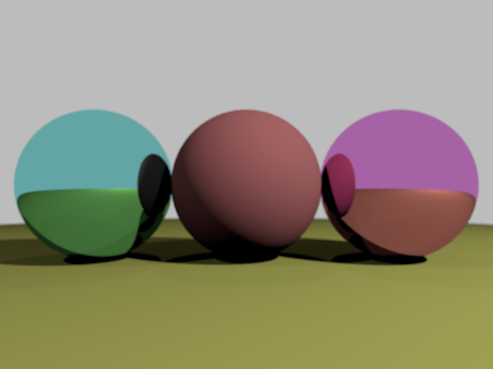

The idea behind defocus blur actually is not hard. Instead of a perfect point, the camera lens becomes a small disk. This means we also randomize the origin of our camera ray. Note the difference between this and Antialiasing above. Antialiasing will randomize the point within each pixel, which effectively randomizes the direction of the camera ray slightly. On the other hand, here we randomize the origin of each camera ray.

The larger the camera lens disk radius, the greater defocus blur effect.

### XML Scene Parser

At the beginning stage, configuring a scene via cpp code directly is convenient. But as we move on and add more features, we need more complex scenes and it becomes ineffective or infeasible to create scenes programmatically.

Fortunately, there are plenty of alternatives coming to the rescue. We chose one that balances ease of use and feature richness: [Mitsuba Renderer XML scene format](https://mitsuba.readthedocs.io/en/latest/src/key_topics/scene_format.html). The XML scene description files are highly readable and [Blender](https://www.blender.org/) has [an exporter plug-in](https://github.com/mitsuba-renderer/mitsuba-blender) for it. In this way, we can build a custom scene, export an XML scene description, render it, and compare the result with the Blender renderer.

The low-level code that parses each node in an XML is provided in Professor's starter code `pare_scene.h` and `parse_scene.cpp`. But it simply "translates" scene definition into corresponding cpp struct and class. But there is more parsing to be done for the scene to better work for the renderer. For example, the scene defines a triangle mesh with arrays (vertex, position, normal, uv) plus some additional global information about the mesh. While, for code efficiency, we want a Triangle struct that stores information for individual triangles. I implemented the scene customization parsing part, which locates in `Scene.h` and `Scene.cpp`.

### Acceleration Structure

This is arguably the most important part of any ray-tracing or path-tracing render. The most frequently called function is ray-scene-intersection, which answers the question "Which object (triangle, sphere, or whatever primitive shape) will this ray hit?" Model/mesh with fine details usually has a triangle count in million magnitudes. Without an acceleration structure, rendering scenes with complex meshes becomes practically impossible.

An acceleration structure solves the following problem: how to test the intersection between a ray and EVERY object in the scene. A brute-force checking has complexity O(N) because it tests ray-shape-intersection against all N shapes in the scene one by one. An acceleration structure can achieve O(log(N)) complexity.

There are 2 common types of acceleration structure: ***spatial subdivision*** and ***bounding volume hierarchies***. Essentially, spatial subdivision divides the 3D scene into cells (3D grids). They will be subdivided repeatedly until a small cell only contains one or two shapes. Bounding volume hierarchies (usually referred to as 'BVH') creates bounding volumes around shapes, and bigger bounding volumes will be created to enclose smaller bounding volumes. I will borrow 2 images from our slides to illustrate:

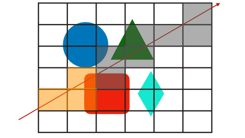
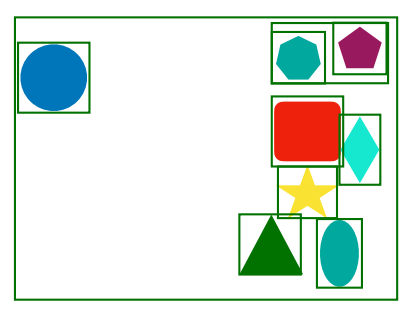

Both techniques utilize the fact that 3D grids and bounding volumes (usually boxes) can be easily merged into bigger ones. If a ray misses a big box entirely, we save the ray-shape-intersection check against all shapes enclosed by the box. With some spatial short-circuiting trick, it achieves ray-scene-intersection in O(log(N)) complexity.

Our renderer implements BVH. And the bounding volume we chose is the most commonly used axis-aligned bounding box, usually referred to as 'AABB'.

### Motion Blur

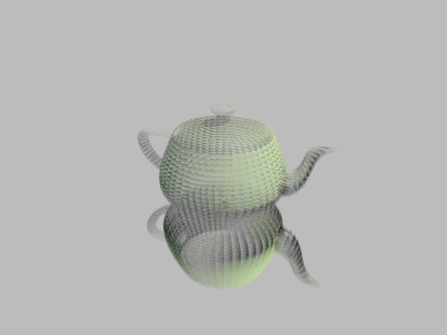

Motion blur is a phenomenon occurred when a real camera captures photos of an object moving fast. The underlying physics is related to exposure time and photons and is quite involved. For our computer graphics artificial camera, what we need is to set a small start-to-end interval, like 1s, start position, and end position. When an object is hit by each ray, we generate a random time in the interval and use the interpolated position. This will create a blurry effect that suggests "this object is moving" to our brain.

### UV Texture Mapping

Textures are used almost everywhere in computer graphics. They are in image format and allow us to specify the appearance independent of the model complexity. In other words, you can attach a super high-resolution image to a plane consisting of 2 triangles, and you can also extrapolate a very small image across a complex mesh to represent patterns.

A little bit more details: when a ray hit a triangle at position p, we can calculate a ***barycentric coordinate*** of p and use it as the ***UV coordinate*** to query/interpolate a pixel RGB value in the texture image space.

The first image below is a low-polygonal mesh with a high-resolution texture. See `scenes/head`. The second image is a complex mesh with several simple textures that creates the brick pattern of the Sponza Palace. See `scenes/sponza`.

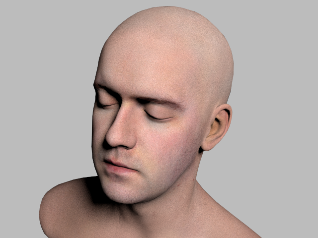
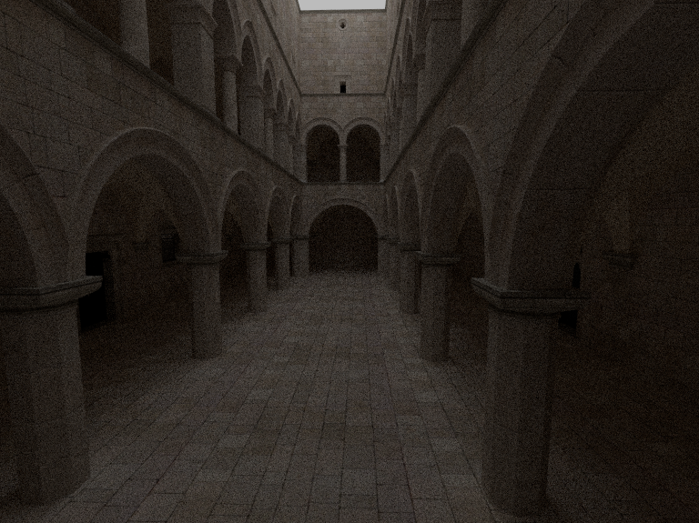

### Shading Normals

This is another brilliant idea invented by Phong and is extensively used in computer graphics. It makes a mesh look smoother and less polygonal, while not increasing the mesh complexity. It uses a similar idea as the UV texture mapping above. This time, the UV coordinate is used to interpolate the 3 vertex normals of the current triangle. This effectively turns a flat triangle in a mesh into a smoothly curved spherical triangle. The discrete change in the normal direction across the edge, which is the source of the polygonal look, will disappear.

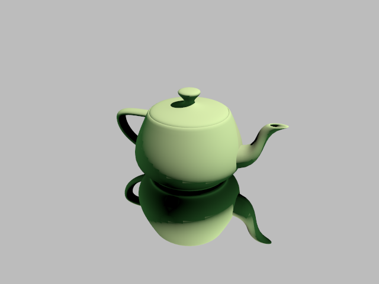

### Area Light (Monte Carlo Integration)

Our renderer begins with only supporting point light, which is the easiest type of light source in computer graphics. Point lights require easier code and offer faster computation, but they also introduce unreal artifacts, such as hard shadow. You can compare the following image with the other one above. The shadow of the head on the shoulder looks very unreal.

To solve this, we introduce the concept of ***area lights***. In essence, the light source becomes an object with volume and surface area. A sphere, a very complex mesh, and whatever being modeled in the scene are capable of being an area light. We assume the light emits from the surface of the light source, so this is why we call them area lights instead of volume lights.

But rendering area-light effects is not easy. In theory, an area light is an infinite collection of infinitesimal points, and we need to consider the radiance contribution from all of them. Mathematically, this is solving an integral, which cannot be done analytically on computers 99% of time.

$$\int_{x \in S} f(x) \mathrm{d}A(x)$$

where $\mathrm{d}A(x)$ means an infinitesimal area around x on the surface, and $f(x)$ is similar to the contribution of a single point light located at $x$:

$$f(x) = \frac{K_d \cdot \max\left(n_s \cdot l, 0\right)}{\pi} \cdot \frac{I \max\left(-n_x \cdot l, 0\right)}{d^2} \cdot \text{visibility}$$

Thus, we need a statistical method, ***Monte Carlo Integration***, to approximate the result. In plain language, it draws random samples in the domain you would integrate over, compute a finite sum from these samples to approximate the integral, an infinite sum.

How to draw these samples is another non-trival question. Statistics API in most programming languages can generate a random sample from any common statistical distribution. But in the rendering context, the area-light shape is a geometry and doesn't fit any distribution. Instead, we need the sampling strategy for shape primitives like sphere and triangle. The formula derivation can be found easily online and we will just include the formula here. Assume we have 2 random numbers, $s$ and $t$, generated from a uniform distribution between 0 and 1, then

- to uniformly sample a point represented by elevation angle $\theta$ and azimuth angle $\phi$ on a spehrical surface:

$$ \theta = cos^{-1}(1 - 2s); \phi = 2\pi t $$

- to uniformly sample a point represented by barycentric coordinates ($b_1$, $b_2$) on a triangle:

$$ b_1 = 1 - \sqrt{s}; b_2 = t \sqrt{s} $$

Furthermore, we don't necessarily need to randomly sample the point across the entire surface, because in rendering, some region of a shape will be occluded. Some improvements on the current sampling strategy are covered in the [Efficient Sampling Strategies](#efficient-sampling-strategies).

At last, the key of Monte Carlo Integration is to scale the sampled value by dividing the probability density of picking this sample. This will give us an unbiased estimate of the integral using one sample points. Here when we randomly pick a position on a sphere or triangle, the probability density is simply (1/area). To use multiple samples to reduce variance, we scale the values first then take the average.

### Efficient Sampling Strategies

#### 1. Sample One Light at a Time

For triangles, the area light property is bound to a triangle mesh instead of single triangles. My baseline area-light implementation suffers when we have a complex mesh as an area light. If the mesh has a million triangle, we need to sample a million times and sum up the radiance contribution from these one million triangles, and this brings the time complexity back to O(N).

The fix isn't hard: we do a 2-step sampling. Before sampling a point on a triangle, we randomly pick several triangles from the complex mesh. A key design choice is to set the probability of being picked proportional to triangle areas. Other implementation details are included in the relative function comments.

#### 2. Cone Sampling a Sphere

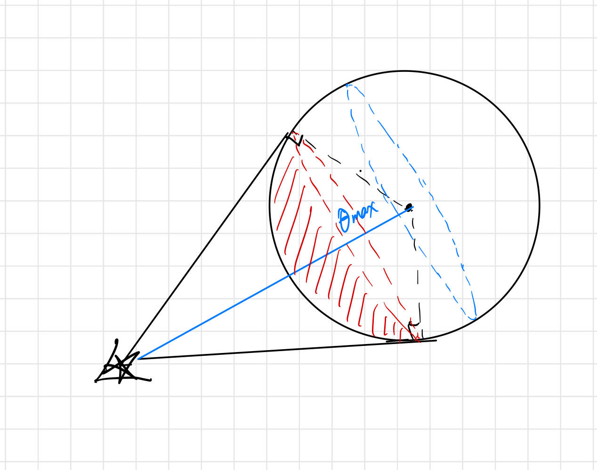

If we look closely at how a spherical area light illuminates a shading point, we will find that more than half of the surface region on the back is blocked by that the region on the front. This makes sampling on the entire sphere surface less effective. Say we draw 8 samples from a spherical light but expect 4~5 of them being occluded and thus give 0 contribution. We take average over 8 samples but only 3 of them are nonzero. We would like to ensure our sample points are always visible and give nonzero contribution, such that in the same scenario we only need to average over 3 samples.\

And here comes the idea of Cone Sampling. From the shading point of view, the visible region is the spherical cap enclosed by a cone tangent to the sphere. This region is colored red in my figure. The size of the spherical cap is controlled by that $\theta_{max}$ whose cosine is computed by (radius / center_to_shading_point). Note that a sphere is a special spherical cap with $\theta_{max} = \pi$. Thus, the Cone Sampling formula becomes:

$$ \theta = cos^{-1}(1 - (1-cos(\theta_{max}))s); \phi = 2\pi t $$

and the surface area of a spherical cap is

$$ 2\pi r^2 (1-cos(\theta_{max})) $$

If you plug in $\theta_{max} = \pi$, you will get both formulas for a sphere.

### 3. Stratified Sampling

This could be the most extensively used sampling strategy. The idea is simple: we subdivide the sampling domain and sample a point from each sub-region. This eliminates the rare case where most samples of shape are concentrated in a region and as a result we get a pixel too bright or too dark.

I picked 2 common stratification methods for triangles and spheres. For a triangle, we connect the 3 middle points on the edges and divide the triangle into 4 equal-area parts. For a sphere, we divide the azimuth angle $\phi$, which ranges from 0 to $2\pi$, into 6 or 8 equally-spaced intervals. Intuitively, this works like dividing an orange into 6 or 8 slices.

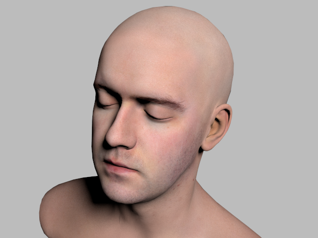

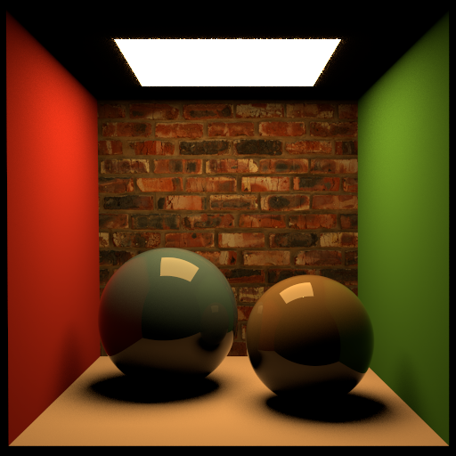

The head is illuminated by a spherical area light. We can clearly observe that those noisy tiny black dots almost disappear. The Cornell Box scene has triangle-mesh area light (that square on the ceiling). Its improvement is not as obvious, but you may still obverse the quality improvement around the shadow boundary.

### Path-Tracing

From now on, we shifts the underlying framework from ray-tracing to path-tracing.

**First, what are their differences?** Their names are not informative enough. Both shoot camera rays and compute image pixel colors from the radiance received by those camera rays. Personally speaking, I would rather call them "deterministic ray-tracing" and "probabilistic ray-tracing". Diving a little deeper, we will know why one is deterministic and the other is probabilistic. The difference lies in when do we shoot an reflected ray at the current shading point and compute the radiance in the next recursion. In ray-tracing, we only shoot the reflected ray in the perfect mirror-reflection direction. With any incoming direction, we reflect it around the shading normal to obtain the mirror-reflection direction. This is "ray-tracing along a deterministic direction". On the other hand, in path-tracing, we always trace the ray along "some" direction. This direction, or more precisely, the probability distribution of the reflective direction, is determined by the physical model of the material at the shading point. Diffuse material, for example, assumes that an incoming ray can bounce off toward any direction above the shading surface with some probability distribution.

**Next, why do we want path-tracing?** In short, path-tracing enable fully global illumination in our rendering. We may continue our discussion for the diffuse material as it exhibits the difference between the two frameworks. Instead of shooting a ray into a random direction and enter the next recursion, in ray-tracing, we calculate the contribution from all lights in the scene and terminate the recursion. This limitation of only considering light sources entirely overlooks the contribution from indirect lights--light reflected by other non-emitting objects. The 2 images below can illustrate the difference well:

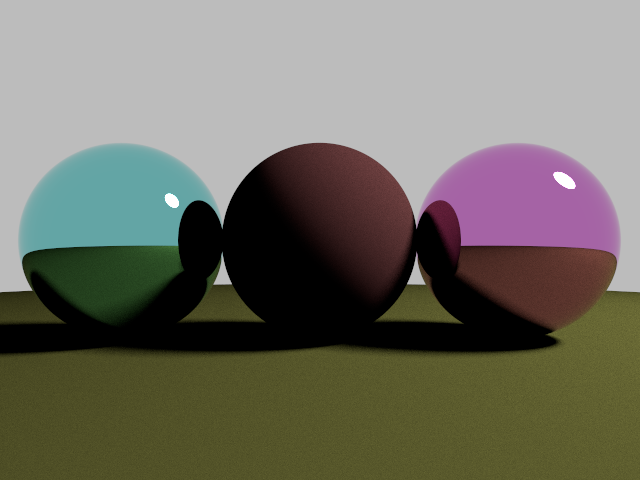
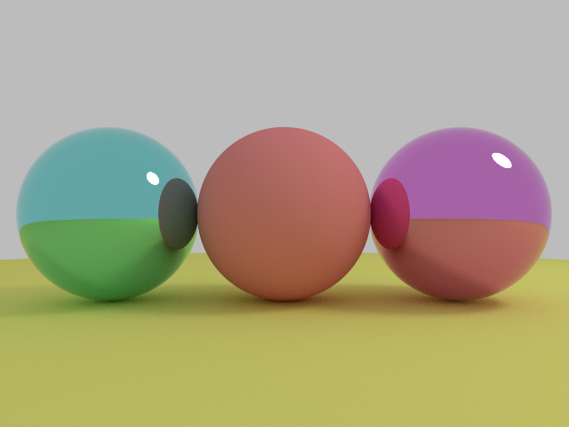

The first image looks nice until you see the second one. You realize that the shadow region shouldn't be that intense because the light bounced off from the ground other spheres should illuminate it.

### BRDF Importance Sampling

Path-tracing sounds promising, but how exactly should we decide which direction to reflect the ray and keep tracing? This is where the famous ***Bidirectional Radiance Distribution Function (BRDF)*** comes into action. BRDF takes in 2 inputs, an incoming ray direction and an outgoing (reflected) ray direction and describes the distribution radiance with respect to these in & out pairs.

Thus, we must perform our sampling differently depending on the underlying BRDF of each material. To be more precise, now our sampling cannot consider the probability distribution of each direction alone. It must follow the BRDF and give more weight to the direction with higher radiance intensity. And this is called ***Importance Sampling**: sampling from important regions, ones that contribute more to the result, with high probability.

### BRDF for Different Materials

Our renderer supports the following types of materials. We will discuss their physical properties and corresponding BRDF one by one. More details can be found in `materials.h`.

#### 1. Diffuse

The diffuse surface is almost always modeled by ***Lambertian Reflectance property*** plus ***Lambertian Cosine law***. In short, they assume that rays coming to a diffuse surface will scatter toward all directions on the hemisphere with equal probability, but the radiance intensity is proportional to the dot product (= cosine) between the shading normal and the scattering direction.

Thus, for a diffuse surface, our sampling must follow a cosine sampling. The formula is the following:

$$ \theta = cos^{-1}(\sqrt{1-s}); \phi = 2\pi t $$

$$ x = cos(\phi)*cos(\theta); y = sin(\phi)*cos(\theta); z = sin(\phi) $$

#### 2. Mirror

Mirror material is the most special case, because we don't need importance sampling to decide an reflection direction at all. The perfect mirror-reflected direction has the probability of 1 being chosen.

#### 3. Plastic

We call it plastic, but similar physical properties are not limited to plastics. In general, many materials have two layers: most of the times they are a thin dielectric layer on the top, called coating, and a diffuse layer under the hood. Our plastic material is a special case where the top dielectric layer works like a mirror.

In path-tracing, we decide to treat it as a diffuse material or a mirror probabilistically. And the probability is described by ***Fresnel Effect***. It is a quite involved physical property, but the key takeaway is: it gives the amount of reflectance you see on a surface depending on the material property and the viewing angle.

In real life, you may observe that the wood floor, especially the one with a wax coating, looks more diffuse-like from the top but more mirror-like at the gazing angle. This phenomenon can be modeled well by our renderer.

#### 4. Phong BRDF

Phong is not a physical materail. Instead, it's a model that fit well for a family of materials whose property lies between perfect mirror and perfect Lambertian diffuse. Intuitively, these materials will reflect rays in directions around the mirror-ray direction. The Phong BRDF is given by the following:

$$ f_{Phong}(\omega_{in}, \omega_{out}) = K_s*\frac{\alpha + 1}{2\pi}*max(r \cdot \omega_{out}, 0)^{\alpha} \text{ if } n \cdot \omega_{out} > 0 \text{ else } 0 $$

where $K_s$ is the reflectance color, $r$ is the mirror reflection direction, and $\alpha$ is usually called the Phong exponent – the larger it is, the more mirror-like the material is.

To importance sample from a Phong BRDF, we use the following formula:

$$ \theta = cos^{-1}((1-s)^\frac{1}{\alpha + 1}); \phi = 2\pi t $$

$$ x = cos(\phi)*cos(\theta); y = sin(\phi)*cos(\theta); z = sin(\phi) $$

From left to right, the Phong exponents are 100, 40, 8, 1.

#### 5. Blinn-Phong BRDF

Similarly, Blinn-Phong is another theoretical model. It addresses 2 major issues brought by Phong model:

1. The "directions around mirror-ray direction" can go below the shading surface at gazing angles. This introduces discontinuities of the distribution.
2. It's not clear how we should blend Fresnel into the model, as Phong models directions around mirror-ray direction, but Fresnel models directions around shading normal.

Blinn-Phong model introduces the concept of ***half vector*** $h$ defined by

$$ h = \frac{\omega_{in} + \omega_{out}}{\lVert \omega_{in} + \omega_{out} \rVert} $$

The good things about half vector $h$ are that it behaves functionally similar to shading normal $n_s$, and $\omega_{in}$ and $\omega_{out}$ are centered around it. Instead of using $\omega_{out}$, Blinn-Phong BRDF gives the following: the outgoing ray has a higher chance in the direction reflected against half vector closer to the shading normal.

$$ f_{BlinnPhong}(\omega_{in}, \omega_{out}) = \frac{\alpha + 2}{4\pi(2-2^{-\frac{\alpha}{2}})} F_h (n_s \cdot h)^{\alpha} \text{ if } n \cdot \omega_{out} > 0 \text{ else } 0 $$

$$ F_h = K_s + (1-K_s)(1-h \cdot \omega_{out})^5 $$

For sampling, we use the same formula as Phong model, but we sample the half vector around shading normal instead of outgoing direction around mirror-ray direction. We do an additional step to reflect incoming ray against half vector to obtain outgoing direction.

#### 6. Microfacet

Again, it's not a physical material. Microfacet Theory models the physical setting of the shading surface on a microscopic level and provide physical support to the heuristic-based Phong and Blinn-Phong models. In essence, the theory treats the shading surface as an infinite collection of tiny mirrors with different orientations, which are called *microfacets*. Their orientations are determined by their "micro-normals" $m$. How likely $\omega_{in}$ scatters along $\omega_{out}$ depends on how many of these microfacets have their $m = h$.

$$ f_{microfacet}(\omega_{in}, \omega_{out}) = \frac{F_h \cdot D \cdot G}{4(n_s \cdot \omega_{in})} \text{ if } n \cdot \omega_{out} > 0 \text{ else } 0 $$

Here, $D$ is the ***Normal Distribution Function (NDF)*** that describes the distribution of micro-normals; $G$ is the geometric shadowing masking term, which accounts for the proportion of unblocked microfacets. I will not explain how the are defined, formulated, and computed, but these details can be found under the `struct Microfacet` under `materials.h`.

Note that there are many NDFs, and our renderer implements two popular versions: Blinn-Phong NDF and GGX (means Ground Glass Unknown).

The sampling formula for Blinn-Phong NDF is exactly the same as above. The formula for GGX is different. You can find it from equation (35) and (36) from [this paper](http://www.graphics.cornell.edu/~bjw/microfacetbsdf.pdf).

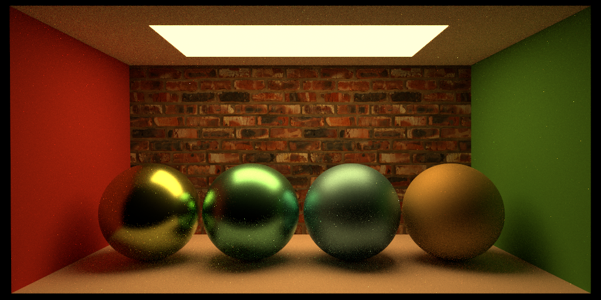
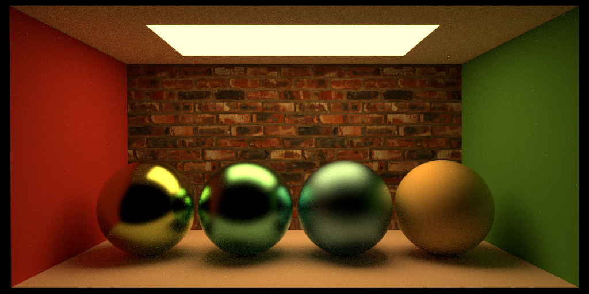

First one uses GGX, second one uses BlinnPhong NDF.

### Multiple Importance Sampling

So far, our path-tracing seems to work out by importance sampling $\omega_{out}$ according to the BRDF of the material. We stop sampling from (area) light sources, because both direct illuminations (light rays from light sources) and indirect illuminations (light rays bounce off from other surfaces) are under the consideration of BRDF importance sampling.

But when can this go wrong? The answer is when some area lights are intense but very small, which will lead to some very noisy pixels in the rendering. For a pixel, when some camera rays (remember the antialiasing technique we use) eventually and luckily hit a small area light, the pixel will be bright. But if unfortunately, none of them hit any small area light, the pixel would be dark. And you realize that point lights we used at the beginning cannot be supported at all, because a point light is an extreme of above cases and every ray has 0 probability to hit a point light.

How do we solve this? The easy answer is to do both, and this is called ***Multiple Importance Sampling (MIS)***. The terminology here starts to get confusing, so I'd like to offer an explanation based on personal understanding, before I dive into the formula. "Multiple" actually means 2, because we do both BRDF sampling a direction $\omega_{out}$ and light sampling a position. Within light sampling strategy, we can get "multiple" samples and average them out.

In this section, we will discuss the vanilla version of Multiple Importance Sampling called one-sample MIS. See [Deterministic MIS](#deterministic-mis) below for an improved version.

"One-sample" means at any shading point, we sample a single direction and trace the outgoing ray along it. We just stated that we want to both sampling strategy, but computability limited us from tracing both a BRDF direction and a light direction, because with each ray splitting into 2, the recursion will grow exponentially.

Combining different samples of the same sampling strategy is straightforward -- you just take the average. But combining the results from different sampling strategies requires some mathematically rigorous insight. First, let's look at the precise, analytical version of the famous ***Rendering Equation***:

$$ L = L_e + \int_{\omega_{out} \in \Omega}^{} f(\omega_{in}, \omega_{out}) \cdot L_i(\omega_{out}, ...) d\omega_{out}  $$

The total spectral radiance $L$ at the current shading point = how much light emitted by itself, called "emitted spectral radiance" $L_e$ + the sum of all spectral radiance at different outgoing direction $\omega_{out}$ scaled by the BRDF $f$.

With Monte Carlo Importance Sampling approximation, its discrete version is:

$$ L = L_e + \frac{1}{n} \sum_{\omega_{out} \in \Omega}^{} \frac{f(\omega_{in}, \omega_{out})}{pdf(\omega_{out})} \cdot L_i(\omega_{out}, ...) $$

The $pdf$ is the probability density function that measures how likely do we sample this particular direction. $n$ is the number of samples we take, and because of the recursion computability described above, we choose $n=1$, "one-sample", for now.

There are several other pieces we must consider. First, how to use both sampling strategy but can only generate one sample $\omega_{out}$? The answer is we choose randomly, by programmatically "flipping a coin".

The core of one-sample MIS is to use a blended pdf from the pdfs from those 2 sampling strategy. One good mathematical property with probability density is that any linear combination of 2 pdfs is guaranteed to also be a pdf. And since we pick BRDF sampling and light sampling by flipping a coin, our blended pdf should give them equal weight. That is saying, we plug in

$$ pdf(\omega_{out}) = \frac{pdf_{light}(\omega_{out}) + pdf_{BRDF}(\omega_{out})}{2} $$

to the Rendering Equation above. This idea turns the task of computing 2 results from 2 sampling strategies to scaling a single result from the probability density of the 2 strategies.

At last, you may notice a key difference between the 2 sampling approaches. BRDF sampling looks for a random direction, but light sampling looks for a random position on some shape. More precisely, BRDF sampling approximates an integral over $d\omega_{out}$, which is called ***solid angle***, the infinitesimal area on a unit sphere/hemisphere covered by the direction. (Remember that we can use a unit hemisphere to represent all possible directions, because they are just unit vectors.) On the other hand, the light sampling approximates an integral over $dx$, the infinitesimal area on the surface of the area light. The conversion factor, usually referred to as ***Jacobian***, is given by

$$ \lvert\frac{dx}{d\omega_{out}}\rvert  = \frac{d^2}{\lvert \omega_{out} \cdot n_x \rvert} $$

where $d$ is the distance from shading point to $x$. The derivation of this conversion factor will not be further discussed here, but it ensures $pdf_{BRDF}$ and $pdf_{light}$ are on the same infinitesimal measurement.

### Deterministic MIS

Next, we introduce an improvement to the one-sample MIS above, called ***deterministic MIS***. This is a more common choice in modern path-tracers, because it offers better rendering result. Its key difference from one-sample MIS is the following: it samples 2 directions from the 2 sampling approaches, but the recursion is only carried for the BRDF-sampling direction. For the light-sampling direction, we deterministically compute the contribution from lights. In this way, we manage to look at 2 directions at each shading point but end up enter one recursion. Note that one-sample MIS has $n=1$, in terms of formula, the difference is

$$ L = L_e + \frac{f(\omega_{in}, \omega_{out})}{pdf(\omega_{out})} \cdot L_i(\omega_{out}, ...) \textnormal{\qquad one-sample MIS} $$

$$ L = L_e + \frac{f(x) \cdot L_{light}(x, ...)}{pdf_{light}(x) + pdf_{BRDF}(x)} + \frac{f(\omega_{in}, \omega_{out}) \cdot L_i(\omega_{out}, ...)}{pdf_{light}(\omega_{out}) + pdf_{BRDF}(\omega_{out})} \textnormal{\qquad deterministic MIS} $$

where $L_i()$ is a recursive function call but $L_{light}()$ is not.

The 2 pairs below (first deterministic MIS, second one-sample MIS) can illustrate the improvement.

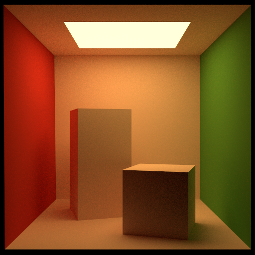

### Russian Roulette

Its original meaning is that people gamble their own life by filling in one or more bullets to a revolver and pull the trigger in turns. The "game" stops when the unlucky guy shoots himself dead. In the rendering context, Russian Roulette means probabilistically terminate a recursive path. It offers a more adaptive recursions by allowing more steps for those contributive recursive calls and fewer steps for those making little difference.

Its most important idea is to dynamically compute the termination probability according to "how significant is the radiance contribution at the current level of recursion?" If you think of the recursion in an iterative (for-loop) framework and temporarily ignore the self-emittance, the contribution from radiance $L_i$ in the next iteration is scaled by $\frac{f()}{pdf()}$ at the current iteration. Thus, we can keep track of a variable $\beta$ which accumulates the multiplication of these scaling factors. The smaller $\beta$ is, the more likely we will terminate the tracing, because that means only a small proportion of the radiance in current iteration will contribute to the original radiance, which belongs to the shading point hit by the camera ray and rendered in the image.

At last, to maintain an unbiased estimation, we need to scale the $\beta$ up by $1-p$, where $p$ is the probability being computed to terminate the tracing.

## Attribute

All the low-level implementation details and design decisions are made by myself, but the high-level ideas are heavily influenced and supported by the following people and sources:

- [Professor Tzu-mao Li, course instructor](https://cseweb.ucsd.edu/~tzli/)
- [Trevor Hedstrom, course TA](https://www.linkedin.com/in/trevor-hedstrom-9abb6362)
- [Starter code by Professor Li](https://github.com/BachiLi/torrey_public)
- [Course Slides](https://cseweb.ucsd.edu/~tzli/cse168/sp2023/) attached to the course website.
- [Ray Tracing in One Weekend series](https://raytracing.github.io/), the famous ray-tracing tutorial series.
- [Physically-based Rendering: from Theory to Implementation](https://www.pbr-book.org/), the famous PBRT book.
- [Eric Veach's thesis](https://graphics.stanford.edu/papers/veach_thesis/), the famous "Bible" for rendering theory foundation.
- Many utilities used by the starter code, see [starter code README](https://github.com/BachiLi/torrey_public#acknowledgement)
- And many other papers/theses for particular techniques. They are attached to the homework specification files and also in the @ref section of my code implementation.

## Author

- [@thomaswang0822](https://github.com/Thomaswang0822)
