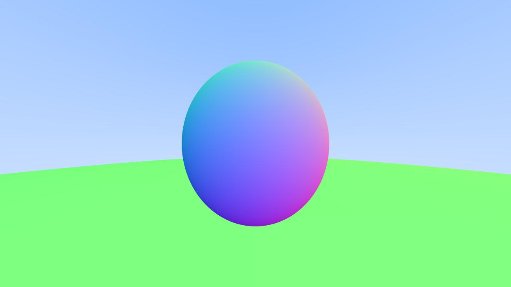

# Final Project

## Team Members

- [Haoxuan Wang](https://github.com/Thomaswang0822?tab=repositories)
- [David Liu](https://github.com/davedav1111)

## Table of Contents

1. Watertight ray triangle intersection
2. GPU rendering (very basic)
3. Fourier BSDF

## Watertight ray triangle intersection

***Source Code Location: torrey_renderer***

The first several sections of PBRT Chapter 3.9 offer very detailed information on floating point error, which includes why floating point operations cannot be precise, how big the error is, how errors accumulate in each step, and so forth.

But before all of these, I'd like to make clear one thing some people may wonder like I do: why don't we use double instead of float to ensure precision. Especially for people who remember some computer science basics well, double generally is as fast as float if we don't consider memory I/O. In fact, it is the memory bound rather than the computational-power bound that restricts the usage of double in certain cases. For a modern renderer, the complexity of the scene passed in could be overwhelming, thus using float can significantly save the memory. Unfortunately, you cannot store the scene with float but using double in path tracing, because the error by float will dominate that by double. Thus, sometimes we have to limit ourselves from using double everywhere.

After all the discussion in PBRT, I want to reiterate one thing. In path tracing, like many other application scenarios, most of the times we effectively only care about those values very close to 0. This include whether the ray hit the bounding box, sphere, triangle, or whatever geometry when close to the boundary. But this doesn't mean that the precision of a large value never matters. A very typical example is when a ray is boucing off toward a complex mesh distant away. We (actually the ray) want to know which triangle in the mesh exactly is first hit by the ray. If the hitting `t` of the current triangle is 40.1, we really want to be 100% sure it's smaller than some `t = 40.12` the ray checked against earlier. In this case, the precision of values far from 0 is also important.

For the implementation, I finished the robust version of ray-bound, ray-sphere, and ray-triangle intersection functions. The first one is in Scene.h::AABB::hit(), the last two are in helper.h::checkRay[Sphere/Tri]Hit(). There isn't much worth discussing in terms of implementation details, since I just follow along the PBRT book and attribute full credit to it.

Let's look at some comparison and have a much clearer idea of (1) how much difference (imprecision) is introduced by switching from double to float and (2) how much compensation is brough by the more robust intersection check. In each group, 3 images are "float with no fix", "float with robust intersection" and "double, our reference image" respectively.

The first is the baseline Cornell Box scene. We can see the huge artifacts on the tall box without the Watertight fix. With the fix, there is no noticable difference at all.


The second is the HW0 single sphere area light scene. Still, the artifact is huge for the image without a robust fix, as we can see the sphere looks much darker than the reference image. But this time, we fail to achieve the same precision as the reference image using double. There is a strange "path" going crossing the middle of the image, and the huge sphere ground is also slightly darker.


## GPU rendering

***Source Code Location: RTOW (basic) & GPU_Render (experiment)***

I was very determined to accomplish this at first, since GPU is arguably the most important component of modern renderer and other computer graphics applications. I found a [blog](https://developer.nvidia.com/blog/accelerated-ray-tracing-cuda/) that teaches people CUDA programming by implementing RTOW with CUDA. It is the perfect beginner tutorial for me, and after some small trouble with GPU configuration, I was able to follow along and reproduce some basic rendering with GPU.



But before I started to implement all the advanced features we did, I realized an unsolvable problem for me. CUDA only supports a very small subset of C++ std library. This means, those std features like vector, variant, filesystem, etc. that are extensively used in our torrey renderer cannot be included in any .cu file. First, I tried to optimize the include logic such that those 'illegal' libraries are only included in .cu source files but not in header files. Also, I replaced vector with built-in array, which is less convenient but could at least work. But later I realized that I couldn't circumvent the usage of variant, otherwise I need to redesign not only `Scene.h` (part of the homework) but also the provided `parsed_scene.h` and, most painfully, rewrite thousands of lines of parser code. This isn't 100% impossible, I don't think it's worth to spend too much time on rewriting parser code in a limited 2 week.

Not to bluff, but after some careful thinking process, I think everything besides variant used in `parsed_scehe.h` has some alternative that works in CUDA. For example, for material variant, I can use a single class called Material and use an enum int ID to identify them. Whenever a function needs to `get_if<>` like we did in torrey renderer, we simply use a switch statement. This and some other experiments I made before deciding to give up this task are included in the `GPU_Render` folder.

At last, to prove that I did put a reasonbale amount of effort before I gave up, I will explain the core memory management idea in CPDA programming. In C++, when you want to use an array (let's use array as example because it works for cpp and cu), you do something like `int arr[5];  // on stack` or `int *arr = new int[5];  // on heap and must delete[] arr later`. But in CUDA, you really want to allocate a space of size 5 integers on the GPU (called device), which means an `int*` pointer on GPU. In addition, in order for the CPU (called host) to retrive the result after GPU computation, we need to have access to that `int*` pointer from CPU. Thus, we need a `int**` double pointer, and this is exactly the argument taken by that family of CUDA memory allocator functions. For example:

```cpp
cudaError_t cudaMallocManaged(void **devPtr, size_t size, unsigned int flags = 1U)
```

It felt very bad to stop the investigation on such an important topic half-way, but I need to finish
my project in farily limited amount of time. I promised myself eventually I will learn CUDA programming well and reproduce this GPU torrery renderer in the near future.

## Fourier BSDF

***Code still being debugged by my partner David***

My partner David was very brave to take a theoretically challenging topic Fourier BSDF. He did make some good progress by following along the code and produce several wrong renderings. Unfortunately, he didn't manage to find all the bugs before the deadline and I was not smart enough to offer any help, besides writing this README section for him. I respect his dogged spirit when debugging project, and I also understand the grading rules. I think what I did, a medium and a 30% finished hard should satisfy the technical difficulty bar. This section is primarily to let our graders know David did work hard and made his contribution to the project.

## Reference

- [Manage Rounding Error, PBRT](https://www.pbr-book.org/3ed-2018/Shapes/Managing_Rounding_Error#)
- [Type float](https://www.pbr-book.org/3ed-2018/Shapes/Managing_Rounding_Error#)
- [Accelerated Ray Tracing in One Weekend in CUDA](https://developer.nvidia.com/blog/accelerated-ray-tracing-cuda/)
