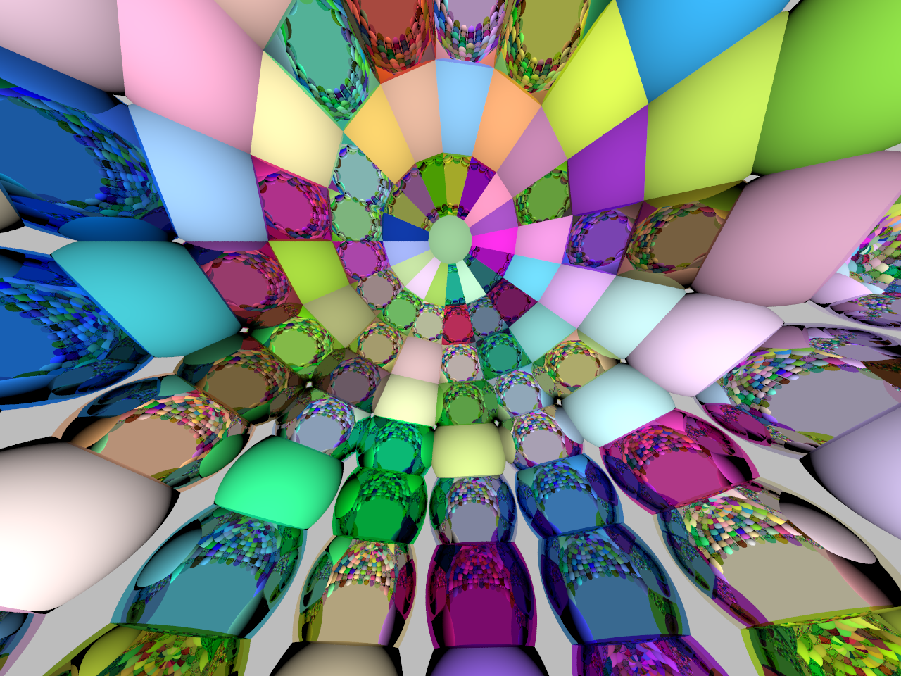

# HW1 Submission

@author [Thomaswnag0822](https://github.com/Thomaswang0822)

## Design My Own Scene

### Location

`Scene hw1_scene_5` inside hw1_scenes.h

### Design

I use many small sphere objects to enclose a bigger hemispeherical space.

The number of unit spheres is determined by the hemisphere radius such that they stick together.

Each sphere has random material `Diffuse` or `Mirror`.

The Python script that generates the scene definition is adopted from Professor Li's script in the write-up.

### Rendering

Reusing 1_8 code; image size 1280 x 960

## Bonus: Glasses

### Design Idea & Explanation

The fundamental design difference between RTOW book and this assignment is that we don't use a Material class. Thus, I didn't define different `scatter()` function for differet materials. Instead, my core helper function is called compute_pixel_colors(), which will call smaller helper functions and do all calculation/checking/recursion, and finally compute the pixel color. For details, please look at the function definition, docstring, and inline comments.

Material Glass and Diamond are both dielectrics and they only differ by refractive indices.

I did some experiment on turning **Schlick Approximation** on/off. Both renderings are shown below.

I reused and modified scene #1 and made it scene #6. In particular, 3 spheres have materials [Diamond, Mirror, Glass] respectively.

The caller is a duplicate of 1_7 code.

### Rendering

Left: with **Schlick Approximation**; Right: without **Schlick Approximation**

## Bonus: Defocus Blur

### Design Idea & Explanation

The overall design is almost identical to the guide in RTOW Chapter 12. I created a `blurCamera` extending `Camera` and add defocus-blur-related feature to it.

One slight improvement I made is the sampling function from a disk. There is a more robust way to generate truly uniformly random point on a disk. For details, please see `Vector3 random_in_unit_disk()` and the reference there in the struct definition.

The caller is a duplicate of 1_8 code. And it works for every scene.

### Rendering

Showing scene 1; 1280 x 960

