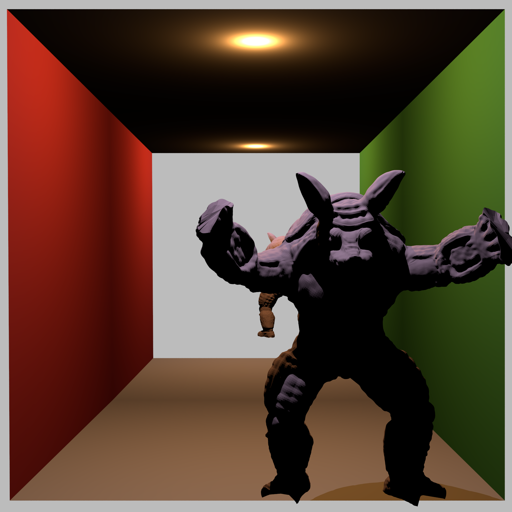

# HW2 Submission

@author [Thomaswnag0822](https://github.com/Thomaswang0822)

## Design My Own Scene

### Location

[`/scenes/cbox_armadillo`](/scenes/cbox_armadillo/cbox_aramadillo.xml)

### Design

This time my scene is quite boring, as I struggled with exporting a "visible" scene from Blender Mitsuba add-on. The scene is visible when being rendered in Blender. But everything disappeared after I fix the xml scene syntax. This is probably caused by the conversion between coordinates.

Anyway, I created a scene with an Armadillo that is trying to escape from the Cornell Box and climb out of your screen. A little childish, but I like that LOL. There are some minor changes like an additional light from the front and a bigger image size.

### Rendering

Reusing 1_8 code; image size 2048 x 2048


## Bonus: Speedup

Following the list of ideas, I tried to implement the following:

- Pick the axis with largetst span (max - min) instead of choosing randomly among x,y,z. This significantly speeds up the rendering time.
- Surface Area Heuristics (SAH). In particular, I used "faked" top-down SAH which approximates the recursive cost by the number of primitives (times the primitive cost, which is always 1.)
- Manually build those top-level BVH nodes according to the meshes they belong to. For details, please look at [this version of `BVH_node` constructor](/src/BVH_node.h#L26). It helps a little bit.
- During BVH traversal (hit check), visit the closer bounding volume first instead of always left. It also helps a little bit.
- Using `std::nth_element()` instead of `std::sort()`. This offers no actual help to my implementation, so I DIDN'T adpot it.

Here is the console log I copied over, also available [here](/logs/speedup_party.log)

```log
$ ./torrey -hw 2_5 ../scenes/party/party.xml -t 2

# random axis
Scene parsing done. Took 0.412886 seconds.
ParsedScene Copied to myScene. Took 0.632706 seconds.
BVH tree built. Took 17.9203 seconds.
 100.00 Percent Done (1200 / 1200)
Parallel Raytracing takes: 40.2762 seconds.

# largest-span axis
Scene parsing done. Took 0.413989 seconds.
ParsedScene Copied to myScene. Took 0.61779 seconds.
BVH tree built. Took 18.0547 seconds.
 100.00 Percent Done (1200 / 1200)
Parallel Raytracing takes: 19.5857 seconds.

# largest-span axis + SAH
Scene parsing done. Took 0.413876 seconds.
ParsedScene Copied to myScene. Took 0.631964 seconds.
BVH tree built. Took 24.3246 seconds.
 100.00 Percent Done (1200 / 1200)
Parallel Raytracing takes: 12.5567 seconds.

# largest-span axis + SAH + manual divide by meshes
Scene parsing done. Took 0.41535 seconds.
ParsedScene Copied to myScene. Took 0.618371 seconds.
BVH tree built. Took 16.6281 seconds.
 100.00 Percent Done (1200 / 1200)
Parallel Raytracing takes: 11.4761 seconds.

# largest-span axis + SAH + manual divide by meshes + hit closer child first
Scene parsing done. Took 0.415706 seconds.
ParsedScene Copied to myScene. Took 0.621978 seconds.
BVH tree built. Took 16.8937 seconds.
 100.00 Percent Done (1200 / 1200)
Parallel Raytracing takes: 9.86718 seconds.
```

## Bonus: Motion Blur
