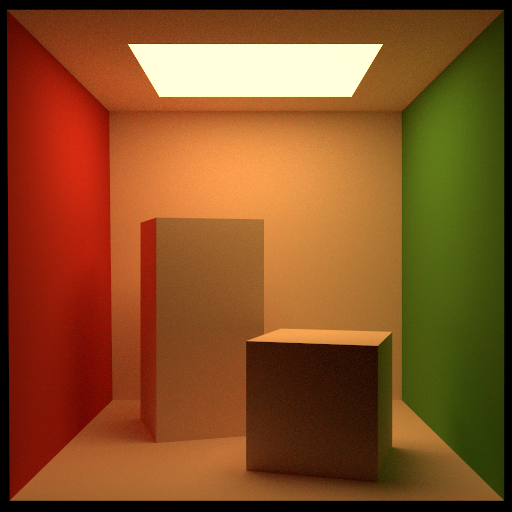
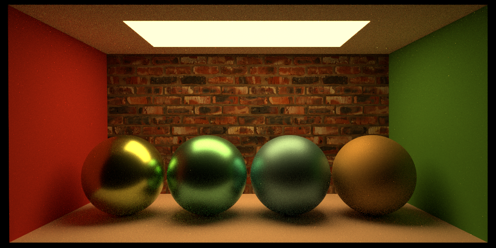

# HW4 Submission

@author [Thomaswnag0822](https://github.com/Thomaswang0822)

## Design My Own Scene

I spent all the time debugging my BONUS, and I really don't enjoy designing my own scene.
I will just put a bigger image of dining-room scene rendered with deterministic MIS here.

### Rendering

1920 x 1440

## Bonus: More Efficient Triangle Light Sampling

This is an unfinished bonus from HW3. I will not include code here this time
since it becomes too long. All the details are in `struct SphTriangle` plus `Vector3 SphTri_sample` in helper.h.

The hardest part, in my point of view, is not understanding the paper or implementing the sampling function pseudocode it gives, but figuring out how to compute the internal angles of a spherical triangle. Professor Chern pointed me to one of his recent papers which has a clear formula for this. Special thanks to him.

To be honest, the rendering gets slower and the result gets more noisy. But this is expected, because this Spherical Triangle sampling becomes efficient when you sample multiple points on the same triangle, which I didn't. Thus, each time I project a triangle light to the local unit sphere and do many calculation, but end up only sampling one point from it.

The author says this method can work with stratified sampling easily, but not for mine. I implemented stratified triangle sampling, but with a pretty arbitrary heuristic: use 3 middle points on the edges to divide the triangle into 4 equal-area sub-triangles. I didn't see how this method can easily fit into my framework.

**Rendering:** use the cbox area-light baseline scene. First is my (noisy) rendering, second is the reference.

## Bonus: Russian Roulette + Deterministic MIS

These 2 parts are done together following the PBRT 14.5.4

Essentially, there are 3 major steps for my code change/addition:

1. Turn my recursive radiance() call into iterative.
2. Add Russian Roulette.
3. Change one-sample MIS to deterministic MIS.

There are lots of details which can be found with function declarations in compute_radiance.h
and all inline comments of their implementations.

One thing worth noticing is that, here Russian Roulette is decided by `beta`, the accumulated
(brdf / pdf). This is definitely more accurate. In CSE 167, there is a non-parametric version,
which means terminate or not is fully decided by if Random(0,1) > the parameter you choose.

The pretty-big improvement in rendering result (noise reduction) is introduced by deterministic MIS. And the rendering speedup is brought by Russian Roulette, though not significant.

**Rendering:** left/top is mine; right/bottom is reference image.

## Bonus: GGX/Trowbridge-Reitz Microfacet Distribution

There isn't much to talk about here in terms of the implementation design, because
we simply follow the paper. One thing to notice is that we need a new sampling function,
which is given by Eq (35) and (36) in the paper, as well as a new PDF, which is just
$D(m) * |m \cdot n|$ in the paper.

To save myself some trouble modifying materials of the scene, adding parser code, and doing more "else if", I just added GGX-related functions to `struct BlinnPhongMicrofacet`, which should have been renamed `Microfacet`.

To try out GGX, switch the following 3 pairs of functions, which are already comment/code at the correct place.

1. `compute_BRDF_GGX()` and `compute_BRDF()` called by a BlinnPhongMicrofacet.
2. `compute_PDF_GGX()` and `compute_PDF()` called by a BlinnPhongMicrofacet.
3. `dir_Phong_sample()` and `dir_GGX_sample()` called in "else if" BlinnPhongMicrofacet.

**Rendering:**

